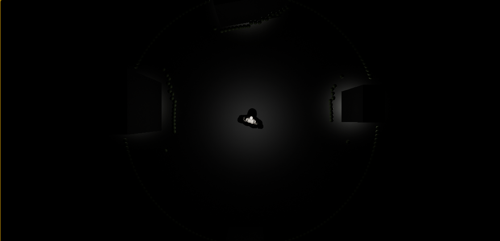
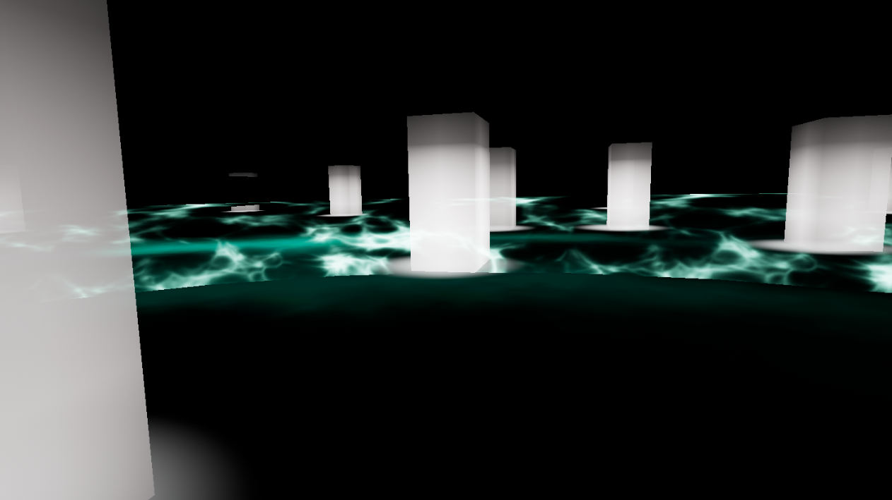
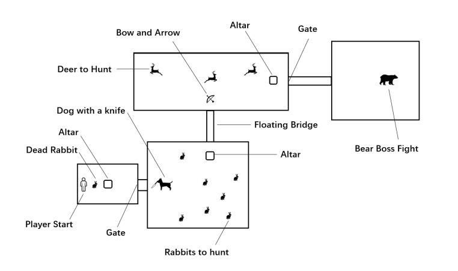

#### 游戏背景

这个游戏最初是我们在玩家体验课的课程设计。我们最初打算模拟蝙蝠的体验，因为蝙蝠不能直接看到物体，而是通过回声定位来感知周围的环境。我们觉得这是一个非常有趣的体验，于是想着模拟这种体验。

#### 设计思路

我们最初的方案是玩家向周围发射小球，通过反射点亮周围的环境。但是随着小球数量增多，这个方案遇到了一些性能问题，以及多次发射时，屏幕上众多的小球看着观感也不好。第二版时我们改成了每次只发射一个特效光圈，并将视角改成了第一人称。我们改了照明机制，使结构一旦被击中就会变得非常明亮，并且变得越来越暗直到熄灭。

随后在导师的建议下，我们试着将这个游戏移植到VR版本，因为VR下看到周围的物体亮起是一种非常奇妙的体验。我们保留了最初的俯视角、第一人称视角和VR视角，做了一系列对比实验收集玩家的反馈，结果大部分人都更加喜欢VR版本的感觉。因此，我们决定专注于VR版本，以提供更身临其境的体验。我们顺着这个思路给游戏加入更多的元素，比如为了模拟蝙蝠而加入了飞行的操纵。我们还制作了一张全新的地图，添加了许多植被以及三棵特殊颜色的树作为玩家的目标。

在完成这个课设之后，我将毕设的选题定位研究VR视角对于玩家沉浸感的影响，继续拓展了这个项目。过程中基于我们的点亮机制，我们有过许多新奇的想法，比如在地图中加入一只喷火的巨龙等，但最后我们为了游戏的完整性不得不舍弃这些疯狂的想法。玩家需要在荒野中捕猎兔子，用弓和匕首猎杀鹿取得心脏，并将猎物供奉在祭坛上以打开通道，最后在狗的帮助下和一只巨熊进行boss战。

最终的完整游戏流程可以在这里看到：



<iframe src="//player.bilibili.com/player.html?aid=540263823&bvid=BV1Yi4y187Tz&cid=181197665&page=1"
	scrolling="no" border="0" frameborder="no" framespacing="0" allowfullscreen="true"
	style="position: absolute; width: 100%; height: 100%; left: 0; top: 0;"> 
	</iframe>



#### 我的职责

这个项目由我和我的同伴两个人完成，我负责**全部**的实现部分。由于ue4的蓝图机制上手比较友好，全程只有对光照亮度计算这些非常底层的代码用c++进行了重写，其他逻辑都在蓝图里完成。过程中VR的接入比想象中简单许多，视角的转换都有现成的，反而是最后给游戏中的熊和狗写AI逻辑的时候，一旦涉及到两个以上AI的交互就会变得非常复杂。
